#Vues & Templating

>*Sommaire*

>>- *1ère vue*
>>- *Mise à jour automatique de l’affichage*
>>- *Sous-vues*
>>- *Templating*
>>- *Évènements*

>*Nous avons joué avec les données dans le chapitre précédent, nous allons maintenant voir comment les afficher dynamiquement dans notre page web.*


Le composant View de Backbone est peut-être celui qui génère le plus de polémiques. Est-ce vraiment une vue ? Ne serait-ce pas plutôt un contrôleur ? Il se trouve que dans une version plus ancienne de Backbone, le composant Controller existait, aujourd’hui il est le devenu le composant Router que nous verrons par la suite… Cependant, un routeur est-il réellement un contrôleur ? Mais rappelez-vous que l’on est dans un contexte client (navigateur) et que le concept MVC « classique » n’est pas forcément « portable » en l’état. L’essentiel est que cela fonctionne et, si les contrôleurs vous manquent à ce point, nous verrons comment en créer quelques chapitres plus loin.

##Préparons le terrain

Pour repartir sur de bonnes bases, nous allons supprimer la base de données avec laquelle nous avons déjà bien joué. Donc supprimez le fichier `blog.db` de la racine de votre application.
Ensuite, modifiez le code javascript de la page `index.html` dans le répertoire `/public`, donc dans la partie `<script></script>`, pour instancier une collection : (on ajoute : `window.blogPosts = new Posts();`)

*Instancier une collection :*

```javascript
$(function() {

  window.Post = Backbone.Model.extend({
  urlRoot: "/blogposts"

  });

  window.Posts = Backbone.Collection.extend({
  model: Post,
  all: function() {
    this.url = "/blogposts";
    return this;
  },
  query: function(query) {
    this.url = "/blogposts/query/" + query;
    return this;
  }
  });

  window.blogPosts = new Posts();
});
```

Sauvegardez, puis relancez votre application (`node app.js ou nodemon app.js`), dans le navigateur accédez à la page principale ([http://localhost:3000/](http://localhost:3000/)), pour enfin ouvrir la console de votre navigateur. Nous allons créer des modèles, que nous ajouterons à la collection blogposts.

###Création et sauvegarde des modèles

Commencez par saisir ceci dans la console du navigateur :

*Ajouter des modèles à la collection :*

```javascript
  var messages = [
  "Maecenas sed diam eget risus varius blandit sit amet non magna.",
  "Integer posuere erat a ante venenatis dapibus posuere velit aliquet.",
  "Donec id elit non mi porta gravida at eget metus.",
  "Lorem ipsum dolor sit amet, consectetur adipiscing elit.",
  "Cras mattis consectetur purus sit amet fermentum.",
  "Nulla vitae elit libero, a pharetra augue."];

  blogPosts.add([
  new Post({
  title: "Premier Message",
  message: messages[0],
  date: new Date(2012, 10, 23, 7, 4, 0, 0),
  author: "bob"
  }),
  new Post({
  title: "Backbone ???",
  message: messages[1],
  date: new Date(2012, 10, 23, 7, 5, 0, 0),
  author: "bob"
  }),
  new Post({
  title: "Les Modèles",
  message: messages[2],
  date: new Date(2012, 10, 23, 7, 6, 0, 0),
  author: "sam"
  }),
  new Post({
  title: "Les Vues",
  message: messages[3],
  date: new Date(2012, 10, 23, 7, 7, 0, 0),
  author: "sam"
  }),
  new Post({
  title: "Les Routes",
  message: messages[4],
  date: new Date(2012, 10, 23, 7, 8, 0, 0),
  author: "bob"
  }),
  new Post({
  title: "Mais où sont les contrôleurs ?",
  message: messages[5],
  date: new Date(2012, 10, 23, 7, 9, 0, 0),
  author: "bob"
  })

  ])
```

>>**Remarque** : en javascript, pour les dates, le chiffre 10 correspond à Novembre (faire +1)

Nous avons donc maintenant 5 Posts dans notre collection. Pour ne pas avoir à tout re-saisir à chaque fois, sauvegardez vos posts (toujours dans la console du navigateur) :

*Sauvegarder les modèles en base :*

```javascript
blogPosts.each(function(post) {
  post.save({}, {
  success: function(post) {
    console.log(post.get("title"), " sauvegardé");
  },
  error: function() {
    console.log("Oupss");
  }
  });
})
```

Vous devriez au final obtenir ceci :

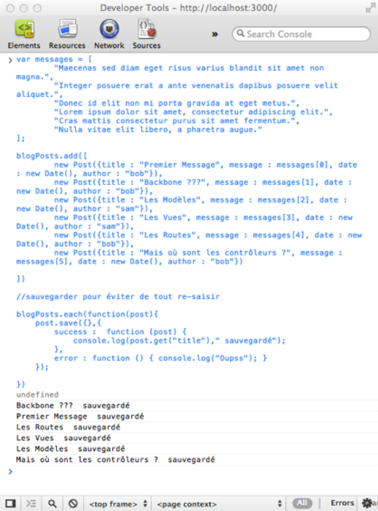


Pour vérifier que la sauvegarde a bien fonctionné, rafraîchissez votre page et lancez ce code dans la console du navigateur :

*Charger la collection avec les modèles sauvegardés en base :*

```javascript
blogPosts.all()
  .fetch({
  success: function(result) {
  console.log(result);
  }
})
```

Si tout va bien (il n’y a pas de raison), vous devriez obtenir ceci :

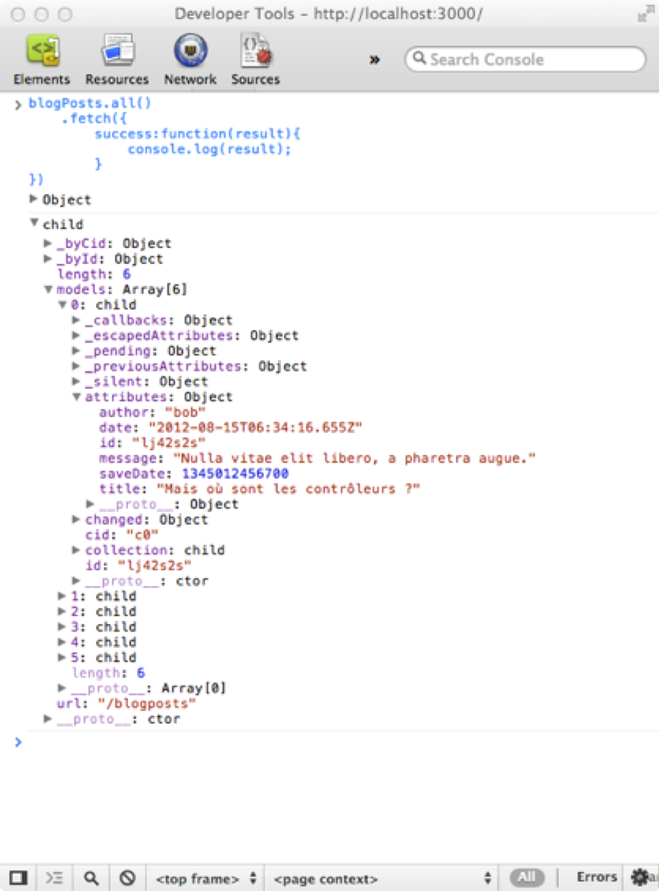


Ainsi, quoiqu’il se passe, vous disposez de tous vos messages et ne serez plus obligés de les ressaisir pour la suite des exercices. Nous pouvons donc entrer dans le vif du sujet.


##1ère vue

Un objet Vue dans Backbone (`Backbone.View`) est généralement composé (au minimum) par convention de :

- une propriété `el` : c'est l'élément du DOM (la partie de votre page html à laquelle on rattache l'objet `View`)
- une méthode `initialize` (déclenchée à l’instanciation de la vue)
- une méthode `render` (chargée d’afficher les données liées à la vue)


>>**Remarque** : Libre à vous de vous faire vos propres bonnes pratiques concernant les responsabilités de l’objet View afin de rendre votre code lisible et maintenable… Vous trouverez toujours quelqu’un pour les discuter mais c’est comme cela que l’on apprend et s’améliore… Et vous pouvez aussi avoir raison :-).

Dans notre page `index.html`, nous allons ajouter un tag `<div id="posts_list"></div>` comme ceci :

```html
<div class="container">
  <div class="jumbotron">
  <h1>Backbone rocks !!!</h1>
  </div>
  <div id="posts_list"></div>
</div>
```

Et modifier le code javascript de la manière suivante : entre la définition de la collection et son instanciation, ajoutez le code de notre première vue :

*1ère vue pour afficher le contenu de la collection :*

```javascript
window.PostsListView = Backbone.View.extend({
  el: $("#posts_list"),
  initialize: function(data) {
  this.collection = data;
  },
  render: function() {
  var html = "";
  $(this.el).html(""); //on vide le div
  this.collection.each(function(model) {

    html += [
    '<h1>' + model.get("title") + '</h1><hr>',
    '<b>par : ' + model.get("author") + '</b> le : ' + model.get("date") + '<br>',
    '<p>' + model.get("message") + '</p>'].join("");

  });

  $(this.el).append(html);

  }
});
```

###Explications & utilisation

Notre vue `PostsListView` est reliée au tag `<div id="posts_list"></div>` par la propriété `el` qui n’est ni plus ni moins qu'un objet **jQuery**. La méthode `initialize` (qui sera appelée à l’instanciation de la vue) prend en paramètre les données que nous souhaitons afficher et les affecte à la propriété `collection` de la vue. La méthode `render`, vide le contenu du tag `<div id="posts_list"></div>`, parcourt la collection de données pour construire le code html, et enfin affiche celui-ci par la commande `$(this.el).append(html)`. Mais utilisons directement notre code, ce sera plus « parlant ».

Sauvegardez, rafraichissez la page et en mode console, passez les étapes qui suivent :

*1] Chargez les données de la collection :*

```javascript
blogPosts.all()
  .fetch({
  success: function(result) {
  console.log(result);
  }
})
```

*2] Instanciez la vue en lui passant la collection en paramètre :*

```javascript
postsListView = new PostsListView(blogPosts)
```

*3] Appelez la méthode render de la vue :*

```javascript
postsListView.render()
```

Et vous obtenez la liste de vos messages :

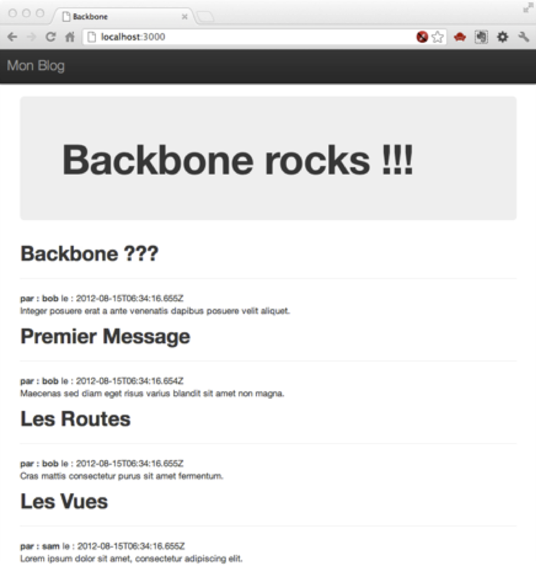


Souvenez vous, dans les chapitres précédents nous avions « donné » aux collections la possibilité de faire des requêtes sur les données avant de lancer un `fetch`. Essayez donc ceci dans la console de votre navigateur :

*Je ne veux que les posts de l’auteur "Sam" :*

```javascript
blogPosts.query('{"author" : "sam"}')
  .fetch({
  success: function(result) {
  console.log(result);
  }
})
```

Puis faite à nouveau un :

```javascript
postsListView.render()
```

Et là, l’affichage s’actualise automatiquement :

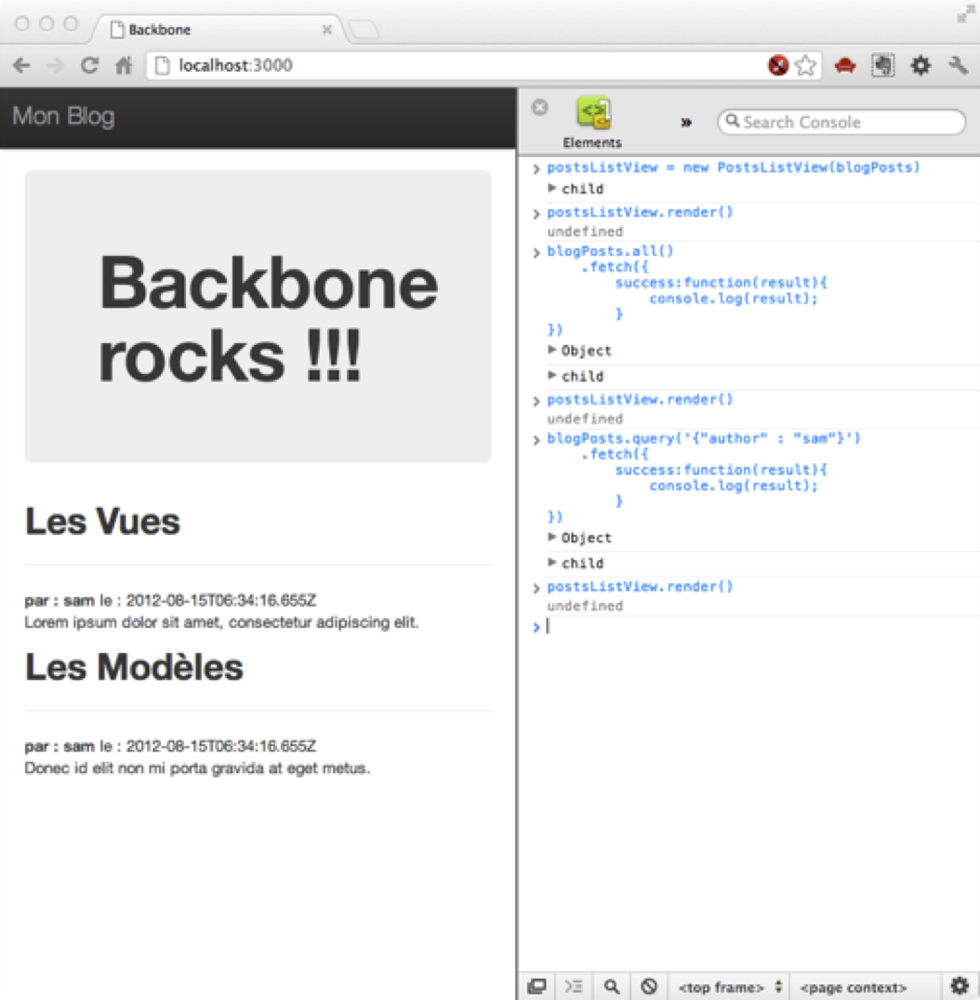


##Maintenant, un peu de magie...

###S'abonner aux événements

Modifions une nouvelle fois notre vue en ajoutant le code suivant à la méthode `initialize` :

```javascript
_.bindAll(this, 'render');
this.collection.bind('reset', this.render);
```

Nous venons d’expliquer que tous les événements déclarés déclencheront la méthode `render` de la vue. Et ensuite nous avons expliqué que la méthode `reset` de la collection déclenchera la méthode `render` de la vue.

>>**Remarque** : Une collection Backbone déclenche un `reset` lors de l’appel d’un `fetch`. La méthode `reset` vide la collection.

  //TODO: faire un chapitre à part sur `_.bindAll`

Le code de notre vue doit donc ressembler à ceci :

*PostListView :*

```javascript
window.PostsListView = Backbone.View.extend({
  el: $("#posts_list"),
  initialize: function(data) {
  this.collection = data;

  _.bindAll(this, 'render');
  this.collection.bind('reset', this.render);

  },
  render: function() {
  var html = "";
  $(this.el).html(""); //on vide le div
  this.collection.each(function(model) {

    html += [
    '<h1>' + model.get("title") + '</h1><hr>',
    '<b>par : ' + model.get("author") + '</b> le : ' + model.get("date") + '<br>',
    '<p>' + model.get("message") + '</p>'].join("");

  });

  $(this.el).append(html);

  }
});
```

Sauvegardez ensuite la page, puis retournez dans le navigateur, rafraîchissez la page et retournez dans la console du navigateur pour instancier une nouvelle vue :

```javascript
postsListView = new PostsListView(blogPosts)
```

Puis essayez ceci :

```javascript
blogPosts.all()
  .fetch({
  success: function(result) {
  console.log(result);
  }
})
```


et cela :

```javascript
blogPosts.query('{"author" : "sam"}')
  .fetch({
  success: function(result) {
  console.log(result);
  }
})
```

Vous remarquez que votre vue se met à jour automatiquement à chaque changement, sans avoir à rappeler la méthode render de la vue.
Mais il est aussi possible de le faire avec les changements sur les modèles.

###S’abonner à d’autres évènements (modèles)

Toujours dans la méthode `initialize` de la vue, ajoutez le code suivant :

```javascript
this.collection.bind('change', this.render);
this.collection.bind('add', this.render);
this.collection.bind('remove', this.render);
```

Maintenant, si vous changez la valeur d'un attribut d'un modèle, que vous ajoutez ou supprimez un modèle de la collection, la vue sera réactualisée à chaque fois.

Sauvegardez la page, puis retournez dans le navigateur, rafraîchissez la page et retournez dans la console du navigateur pour instancier une nouvelle vue et charger les données de la collection :

```javascript
postsListView = new PostsListView(blogPosts)
blogPosts.all()
  .fetch({
  success: function(result) {
  console.log(result);
  }
})
```

Puis changez le titre du 1er post :

```javascript
blogPosts.at(0).set("title","BACKBONE ???!!!")
```

ou ajoutez un post :

```javascript
blogPosts.add(new Post({title:"HELLO",message : "salut", author : "k33g"}))
```

ou encore supprimez un post :

```javascript
blogPosts.remove(blogPosts.at(0));
```

Là encore, votre page s’actualise instantanément.

###Amélioration & Finalisation du code

Avant de passer à l’utilisation des templates dans les vue, nous allons apporter quelques modifications et améliorer un peu notre code pour nous préparer à la suite.

Dans ses dernières versions, Backbone a hérité d’un raccourci concernant la propriété `el` de la vue qui consiste à remplacer (avec pour objectif l’optimisation d’exécution de code) le sélecteur `$(this.el)` par `this.$el`.

De plus, vous devez savoir qu’il n’est pas obligatoire de déclarer l’affectation de la collection dans la méthode initialize de la vue, mais que l’on peut faire ceci directement en paramètre du constructeur à l’instanciation de la vue. Comme ceci :

```javascript
new PostsListView({collection : blogPosts})
```

On pourrait faire de même avec `el`, et utiliser ceci :

```javascript
new PostsListView({el : $("#posts_list"), collection : blogPosts})
```

En fait tout dépend de vos besoins (et de vos habitudes).

En ce qui nous concerne, modifions le code de notre vue de la manière suivante :

*PostsListView :*

```javascript
window.PostsListView = Backbone.View.extend({
  el: $("#posts_list"),
  initialize: function() {

  _.bindAll(this, 'render');
  this.collection.bind('reset', this.render);
  this.collection.bind('change', this.render);
  this.collection.bind('add', this.render);
  this.collection.bind('remove', this.render);

  },
  render: function() {
  var html = "";
  this.$el.html(""); //on vide le div
  this.collection.each(function(model) {

    html += [
    '<h1>' + model.get("title") + '</h1><hr>',
    '<b>par : ' + model.get("author") + '</b> le : ' + model.get("date") + '<br>',
    '<p>' + model.get("message") + '</p>'].join("");

  });

  this.$el.append(html);

  }
});
```

Puis à la fin du code javascript, ajoutez le code qui instancie la vue, ainsi que le code qui « charge » la collection (on se souvient que le render de la vue sera déclenché automatiquement une fois le `fetch` de la collection terminé.) :

```javascript
window.postsListView = new PostsListView({
  collection: blogPosts
})

blogPosts.all().fetch({
  success: function(result) {
  console.log(result);
  }
});
```

Le code final du script dans la page devrait ressembler à ceci :

*Code final :*

```html
<!-- === code applicatif === -->
<script>
$(function() {

  window.Post = Backbone.Model.extend({
  urlRoot: "/blogposts"

  });

  window.Posts = Backbone.Collection.extend({
  model: Post,
  all: function() {
    this.url = "/blogposts";
    return this;
  },
  query: function(query) {
    this.url = "/blogposts/query/" + query;
    return this;
  }

  });

  window.PostsListView = Backbone.View.extend({
  el: $("#posts_list"),
  initialize: function() {

    _.bindAll(this, 'render');
    this.collection.bind('reset', this.render);
    this.collection.bind('change', this.render);
    this.collection.bind('add', this.render);
    this.collection.bind('remove', this.render);

  },
  render: function() {
    var html = "";
    this.$el.html(""); //on vide le div
    this.collection.each(function(model) {

    html += [
      '<h1>' + model.get("title") + '</h1><hr>',
      '<b>par : ' + model.get("author") + '</b> le : ' + model.get("date") + '<br>',
      '<p>' + model.get("message") + '</p>'].join("");

    });

    this.$el.append(html);

  }
  });

  window.blogPosts = new Posts();

  window.postsListView = new PostsListView({
  collection: blogPosts
  })

  blogPosts.all().fetch({
  success: function(result) {
    //ça marche !!!
  }
  });
});
</script>
```

Nous avons fait un peu de magie, passons donc à la sorcellerie ;) ...

##Utilisation du templating... 1ère fois

Vous vous souvenez ? Je vous avais parlé d'Underscore avec les templates ? Eh bien il est temps de les mettre en œuvre.

###Définition de notre 1er template

Dans la partie HTML de notre page, juste avant  `<div id="posts_list"></div>`, ajoutez le code ci-dessous (ce sera notre template) :

```html
<!-- template pour les posts -->
<script type="text/template" id="posts_list_template">

<% _.each(posts ,function(post){ %>
  <h1><%= post.get("title") %></h1><hr>
  <b>par : <%= post.get("author") %></b> le : <%= post.get("date") %><br>
  <p><%= post.get("message") %></p>
<% }); %>

</script>
```

>>**Remarque** : le fait de définir le template à l'intérieur de `<script type="text/template"></script>` fait que le modèle de template ne sera pas affiché dans la page.

En fait (grâce à Underscore), nous venons de définir le template dont la vue Backbone va se servir pour afficher les données. Il faudra lui passer pour cela un **tableau** de posts.
Modifions donc notre vue de la façon suivante :

```javascript
window.PostsListView = Backbone.View.extend({
  el: $("#posts_list"),
  initialize: function() {
  this.template = _.template($("#posts_list_template").html());

  _.bindAll(this, 'render');
  this.collection.bind('reset', this.render);
  this.collection.bind('change', this.render);
  this.collection.bind('add', this.render);
  this.collection.bind('remove', this.render);

  },
  render: function() {
  var renderedContent = this.template({
    posts: this.collection.models
  });

  this.$el.html(renderedContent);
  }
});
```

Nous avons inséré dans la méthode `initialize` : `this.template = _.template($("#posts_list_template").html());`, où nous expliquons que la définition du template se trouve dans la zone ayant `posts_list_template` pour `id`. Nous avons aussi simplifié grandement le contenu de la méthode render, où nous faisons générer le contenu HTML à partir du template et des données.

>>**Remarque** : notez bien que `this.collection.models` est un tableau de modèles.

Vous pouvez sauvegarder et rafraîchir, les résultats sont identiques aux précédents, mais il est beaucoup plus facile de créer et modifier vos templates html.

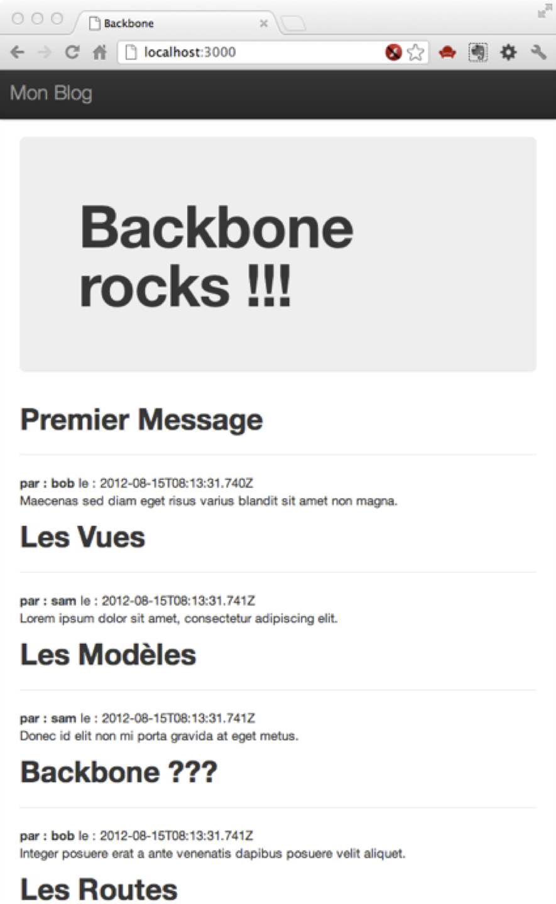


##Sous-vue(s)

Il est possible de faire des sous-vues pour gérer différentes parties de votre page web. En fait il s’agit de vues encapsulées dans une autre vue, ce qui peut être pratique en termes d’organisation, mais aussi dans les cas où les comportements de chacunes des vues dépendent les uns des autres.

Nous allons donc profiter des possibilités de Twitter Bootstrap pour revoir un peu la mise en page de notre « site » et du même coup mettre en œuvre le concept de sous-vue.

###Réorganisation du code html

Modifions notre code html de la manière suivante :

```html
<div class="navbar navbar-inverse navbar-fixed-top">
    <div class="navbar-header">
        <div class="container">
            <a class="navbar-brand">Mon Blog</a>
        </div>
    </div>
</div>

<div class="container">

  <div class="row">

    <div class="col-md-3">
      <script type="text/template" id="blog_sidebar_template">
        <h2>Les 3 derniers :</h2>
        <ul>
        <% _.each(posts ,function(post){ %>
          <li><%= post.get("title") %></li>
        <% }); %>
        </ul>
      </script>
      <div class="sidebar" id="blog_sidebar">
        <!-- Last 3 posts -->
      </div>
    </div>

    <div class="col-md-9">
      <div class="jumbotron">
        <h1>Backbone rocks !!!</h1>
      </div>

      <!-- template pour les posts -->
      <script type="text/template" id="posts_list_template">

        <% _.each(posts ,function(post){ %>
          <h1><%= post.get("title") %></h1><hr>
          <b>par : <%= post.get("author") %></b> le : <%= post.get("date") %><br>
          <p><%= post.get("message") %></p>
        <% }); %>

      </script>
      <div id="posts_list"></div>
    </div>
  </div>
</div>
```

>>**Explications** : nous avons donc 2 templates, un pour afficher les 3 derniers posts (`id="blog_sidebar_template"`), un pour afficher tous les posts (`id="posts_list_template"`).

###Création & Modification des vues

Nous allons créer une vue principale (`MainView`) qui se chargera de "piloter" 2 sous-vues (`SidebarView` et `PostsListView`) :

*1] Simplifions PostsListView :*

```javascript
window.PostsListView = Backbone.View.extend({
  el: $("#posts_list"),
  initialize: function() {
    this.template = _.template($("#posts_list_template").html());
  },
  render: function() {
    var renderedContent = this.template({
      posts: this.collection.models
    });
    this.$el.html(renderedContent);
  }
});
```

*2] Création de SidebarView :*

```javascript
window.SidebarView = Backbone.View.extend({
  el: $("#blog_sidebar"),
  initialize: function() {
    this.template = _.template($("#blog_sidebar_template").html());
  },
  render: function() {
    var renderedContent = this.template({
      posts: this.collection.models
    });
    this.$el.html(renderedContent);
  }
});
```

*3] Création de la vue principale :*

```javascript
window.MainView = Backbone.View.extend({
  initialize: function() {

    _.bindAll(this, 'render');
    this.collection.bind('reset', this.render);
    this.collection.bind('change', this.render);
    this.collection.bind('add', this.render);
    this.collection.bind('remove', this.render);

    this.sidebarView = new SidebarView();
    this.postsListView = new PostsListView({
      collection: blogPosts
    });

  },
  render: function() {
    this.sidebarView.collection = new Posts(this.collection.first(3));
    this.sidebarView.render();
    this.postsListView.render();
  }
});
```

C'est donc maintenant la vue `MainView` qui s'abonne aux changements de la collection et déclenche le rendu des 2 autres vues.

Et enfin instancions la collection ainsi que la vue principale (qui se chargera d’instancier les deux sous-vues). Donc à la place de :

```javascript
window.blogPosts = new Posts();
window.postsListView = new PostsListView({
  collection: blogPosts
})
```

**Nous aurons ceci :**

```javascript
window.blogPosts = new Posts();
window.mainView = new MainView({
  collection: blogPosts
});
```

Vous pouvez sauvegarder votre code et rafraîchir votre page :

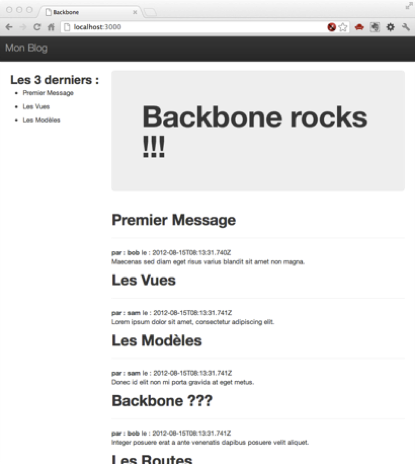


Et si vous faites ceci en mode console :

```javascript
blogPosts.at(0).set("title","Bonjour à tous !")
```

Vous verrez que les modifications sont bien propagées dans les 2 vues simultanément.

###Un dernier petit réglage : tri des collections

Nous souhaitons avant d’aller plus loin trier la collection de posts pour avoir les message en ordre chronologiquement décroissant. Pour cela nous allons créer ce que l’on appelle un **« comparator »** dans la méthode `initialize` de la vue principale `MainView` :

*Trier la collection par ordre décroissant de date :*

```javascript
this.collection.comparator = function(model) {
  return -(new Date(model.get("date")).getTime());
}
```

Donc le code final de MainView sera celui-ci :

*Vue principale :*

```javascript
window.MainView = Backbone.View.extend({
  initialize: function() {

    this.collection.comparator = function(model) {
      return -(new Date(model.get("date")).getTime());
    }

    _.bindAll(this, 'render');
    this.collection.bind('reset', this.render);
    this.collection.bind('change', this.render);
    this.collection.bind('add', this.render);
    this.collection.bind('remove', this.render);

    this.sidebarView = new SidebarView();
    this.postsListView = new PostsListView({
      collection: this.collection
    });

  },
  render: function() {

    this.sidebarView.collection = new Posts(this.collection.first(3));
    this.sidebarView.render();
    this.postsListView.render();
  }
});
```

Et le rendu dans le navigateur devrait vous donner ceci :

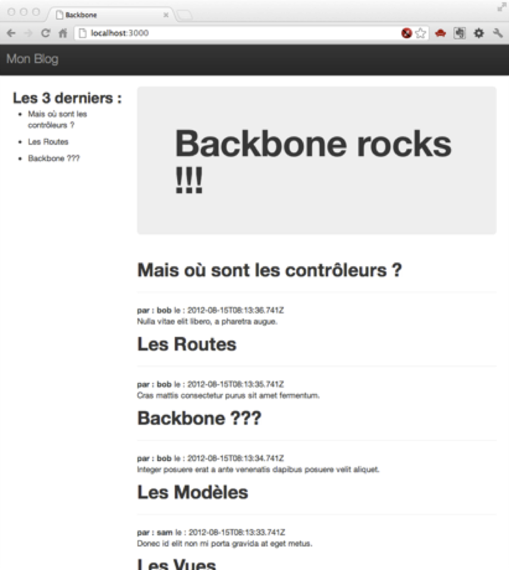


  //TODO : faire un paragraphe sur le comparator dans le chapitre sur les collections

##Utilisation d’autre(s) moteur(s) de template

Vous lirez souvent que Backbone est "framwork agnostic", donc vous pouvez par exemple l'utiliser avec **zepto**, plutôt que **jQuery** en ce qui concerne la gestion du DOM et des appels Ajax. Il en est de même avec le moteur de template. Rien ne vous oblige à utiliser celui d’**Underscore**.
Un des plus utilisé est Mustache.js ([http://mustache.github.com/](http://mustache.github.com/)). Vous pouvez récupérer le code ici : [https://github.com/janl/mustache.js/](https://github.com/janl/mustache.js/). En fait, plus précisément,  enregistrez le fichier  [https://raw.github.com/janl/mustache.js/master/mustache.js](https://raw.github.com/janl/mustache.js/master/mustache.js) dans votre répertoire `public/libs/vendors`. Puis faites-y référence dans votre page `index.html` :

```javascript
<script src="libs/vendors/mustache.js"></script>
```

Et nous allons une fois de plus "casser" notre code html.

###Redéfinissons donc nos templates

*1] Avant pour la partie concernant la vue `SidebarView` nous avions ceci :*

```html
<script type="text/template" id="blog_sidebar_template">
  <h2>Les 3 derniers :</h2>
  <ul>
  <% _.each(posts ,function(post){ %>
      <li><%= post.get("title") %></li>
  <% }); %>
  </ul>
</script>
```

*2] Que vous allez remplacer par ceci :*

```html
<script type="text/template" id="blog_sidebar_template">
  <h2>Les 3 derniers :</h2>

  <ul>{{#posts}}
    <li>{{title}}</li>
  {{/posts}}</ul>

</script>
```

*3] En ce qui concerne le template lié à la vue PostsListView, remplacez :*

```html
<script type="text/template" id="posts_list_template">

  <% _.each(posts ,function(post){ %>
    <h1><%= post.get("title") %></h1><hr>
    <b>par : <%= post.get("author") %></b> le : <%= post.get("date") %><br>
    <p><%= post.get("message") %></p>
  <% }); %>

</script>
```

*4] Par :*

```html
<script type="text/template" id="posts_list_template">

  {{#posts}}
    <h1>{{title}}</h1>
    <b>par : {{author}}</b> le : {{date}}<br>
    <p>{{message}}</p>
  {{/posts}}

</script>
```

Nous obtenons donc des templates html plus lisibles, utilisables moyennant une petite modification de nos vues :

*5] Avant (avec le moteur de template d’Underscore) :*

```javascript
window.PostsListView = Backbone.View.extend({
  el: $("#posts_list"),
  initialize: function() {
    this.template = _.template($("#posts_list_template").html());
  },
  render: function() {
    var renderedContent = this.template({
      posts: this.collection.models
    });
    this.$el.html(renderedContent);
  }
});

window.SidebarView = Backbone.View.extend({
  el: $("#blog_sidebar"),
  initialize: function() {
    this.template = _.template($("#blog_sidebar_template").html());
  },
  render: function() {
    var renderedContent = this.template({
      posts: this.collection.models
    });
    this.$el.html(renderedContent);
  }
});
```

*6] Après (en utilisant Mustache) nous aurons ceci :*

```javascript
window.PostsListView = Backbone.View.extend({
  el: $("#posts_list"),
  initialize: function() {
    this.template = $("#posts_list_template").html();
  },
  render: function() {
    var renderedContent = Mustache.to_html(
    this.template, {
      posts: this.collection.toJSON()
    });

    this.$el.html(renderedContent);
  }
});

window.SidebarView = Backbone.View.extend({
  el: $("#blog_sidebar"),
  initialize: function() {
    this.template = $("#blog_sidebar_template").html();
  },
  render: function() {
    var renderedContent = Mustache.to_html(
    this.template, {
      posts: this.collection.toJSON()
    });

    this.$el.html(renderedContent);
  }
});
```

Vous noterez l'utilisation de `this.collection.toJSON()` plutôt que `this.collection.models`. En effet Mustache a besoin d’objets au format JSON, et (cela tombe bien) les collections Backbone disposent d’une méthode d’exportation/mise en forme au format JSON.

Sauvegardez, lancez, il n’y a pas de changement, l'affichage est identique (heureusement), vous avez juste utilisé une autre façon de travailler.

##Gestion des événements dans les vues

Les objets de type Backbone.View peuvent aussi gérer les événements (mouseover, click, etc.). Nous allons donc profiter de ce paragraphe pour mettre en œuvre un système d’authentification dans notre application, qui utilisera cette possibilité. Il est temps de retourner travailler côté serveur quelques instants.

Si vous voulez en savoir plus sur les événements dans les vues Backbone, je vous engage fortement à lire la documentation : [http://backbonejs.org/#View-delegateEvents](http://backbonejs.org/#View-delegateEvents).

Donc…

##Authentification (côté serveur) : les utilisateurs

>>*Ce paragraphe ne parle pas des vues mais est nécessaire pour la mise en place des paragraphes suivants.*

Nous aurons besoin d’une liste des utilisateurs connectés (je vous le rappelle, nous sommes côté serveur, donc dans le fichier `app.js`) que nous représenterons sous la forme d’un tableau de variables (ou d’objets) :

```javascript
var connectedUsers = [];
```

Nous aurons besoin d’ajouter des utilisateurs dans notre base de données, donc nous allons nous créer de quoi rajouter au moins une fois quelques utilisateurs pour notre application :

*Ajouter un utilisateur en base :*

```javascript
function addUser(user) {
  users.save(null, user, function(err, key) {
    if (err) {
      console.log("Erreur : ", err);
    } else {
      user.id = key;
      console.log(user);
    }
  });
}
```

Nous appellerons n fois cette fonction pour ajouter des utilisateurs :

*Ajouter des utilisateurs :*

```javascript
function addUsers() {
  addUser({
    email     : "bob@morane.com",
    password  : "backbone",
    isAdmin   : true,
    firstName : "Bob",
    lastName  : "Morane"
  });
  addUser({
    email     : "sam@lepirate.com",
    password  : "underscore",
    isAdmin   : false,
    firstName : "Sam",
    lastName  : "Le Pirate"
  });

  //etc.
}
```

Et pour déclencher l’ajout des utilisateurs, nous créons une « route » `addusers` :

```javascript
app.get('/addusers', function(req, res) {
  addUsers();
  res.json({
    MESSAGE: "Users added."
  });
});
```

Qu’il suffira d’appeler comme ceci dans le navigateur : [http://localhost:3000/addusers/](http://localhost:3000/addusers/)

>>**Remarque** : notez bien que mon système d’authentification est très « léger ». En production, il vous faudrait quelque chose de plus abouti, mais ce n’est pas le propos de cet ouvrage, nous avions besoin de quelque chose de simple.

###S’authentifier – Se déconnecter

Nous aurons besoin de nous authentifier. Il nous faut donc d’abord une fonction « utilitaire » qui nous permette de vérifier si l’email de l’utilisateur n’est pas déjà pris (utilisateur déjà connecté sous une autre session) :

*Vérifier si un utilisateur est déjà connecté :*

```javascript
function findUserByMail(email) {
  /*
    Permet de vérifier si un utilisateur est déjà loggé
  */
  return connectedUsers.filter(function(user) {
    return user.email == email;
  })[0];
}
```

Nous allons donc créer une route `authenticate` avec le code suivant :

*Code pour s’authentifier :*

```javascript
app.post('/authenticate', function(req, res) {
  console.log("POST authenticate ", req.body);
  //Je récupère les information de connexion de l'utilisateur
  var user = req.body;

  //est ce que l'email est déjà utilisé ?
  if (findUserByMail(user.email)) {
    res.json({
      infos: "Utilisateur déjà connecté"
    })
  } else { //si l'email n'est pas utilisé
    //Je cherche l'utilisateur dans la base de données
    users.find({
      email: user.email,
      password: user.password
    },

    function(err, results) {
      if (err) {
        res.json({
          error: "Oups, Houson, on a un problème"
        });
      } else {
        //J'ai trouvé l'utilisateur
        var key = Object.keys(results)[0],
          authenticatedUser = results[key];

        //Je rajoute l'id de session à l'objet utilisateur

        authenticatedUser.key = key;
        authenticatedUser.sessionID = req.sessionID;

        //Ajouter l'utilisateur authentifié à la liste des utilisateurs connectés
        connectedUsers.push(authenticatedUser);

        //Je renvoie au navigateur les informations de l'utilisateur
        // ... sans le mot de passe bien sûr
        res.json({
          email: authenticatedUser.email,
          firstName: authenticatedUser.firstName,
          lastName: authenticatedUser.lastName,
          isAdmin: authenticatedUser.isAdmin
        });
      }
    });
  }

});
```

>>**Remarque** : La « bienséance » (d’un point de vue architecture) voudrait qu'on ne mette pas tout ce code au niveau de la route mais dans la méthode d’un contrôleur qui serait appelée par la route. Une fois de plus je vais au plus court, mais gardez à l’esprit qu'il faut toujours un code lisible et maintenable.

Il faudra aussi pouvoir se déconnecter. Nous ajoutons donc une route `logoff` qui nous permettra de déconnecter l’utilisateur.

Nous avons tout d’abord besoin d’une fonction nous permettant de retrouver un utilisateur par son id de session parmi les utilisateurs connectés :

```javascript
function findUserBySession(sessionID) {
  /*
    Permet de retrouver un utilisateur par son id de session
  */
  return connectedUsers.filter(function(user) {
    return user.sessionID == sessionID;
  })[0];

}
```

Que nous allons utiliser ensuite dans notre route `logoff` :

*Se déconnecter :*

```javascript
app.get('/logoff', function(req, res) {

  //Je recherche l'utilisateur courant parmi les utilisateurs connectés
  var alreadyAuthenticatedUser = findUserBySession(req.sessionID);

  if (alreadyAuthenticatedUser) {
    //Je l'ai trouvé, je le supprime de la liste des utilisateurs connectés
    var posInArray = connectedUsers.indexOf(alreadyAuthenticatedUser);
    connectedUsers.splice(posInArray, 1);
    res.json({
      state: "disconnected"
    });
  } else {
    res.json({});
  }

});
```

Nous aurons aussi besoin d’un moyen pour savoir (côté client) si un utilisateur est déjà connecté. Donc nous allons créer une route `alreadyauthenticated` que la page web pourra « appeler » pour vérification (par exemple au rechargement de la page) :

*Est-ce que je suis déjà authentifié ?*

```javascript
app.get('/alreadyauthenticated', function(req, res) {

  var alreadyAuthenticatedUser = findUserBySession(req.sessionID);

  //Si je suis déjà authentifié, renvoyer les informations utilisateur
  if (alreadyAuthenticatedUser) {
    res.json({
      email: alreadyAuthenticatedUser.email,
      firstName: alreadyAuthenticatedUser.firstName,
      lastName: alreadyAuthenticatedUser.lastName,
      isAdmin: alreadyAuthenticatedUser.isAdmin
    });
  } else {
    res.json({});
  }

});
```

Nous somme maintenant prêts à utiliser tout cela côté client. Le code définitif de `app.js` devrait ressembler à ceci :

```javascript
/*--------------------------------------------
  Déclaration des librairies
--------------------------------------------*/
var express = require('express'),
  nStore = require('nstore'),
  app = module.exports = express();

nStore = nStore.extend(require('nstore/query')());

/*--------------------------------------------
  Paramétrages de fonctionnement d'Express
--------------------------------------------*/
app.use(express.json());
app.use(express.urlencoded());
app.use(express.methodOverride());
app.use(express.static(__dirname + '/public'));
app.use(express.cookieParser('ilovebackbone'));
app.use(express.session({
  secret: "ilovebackbone"
}));

/*--------------------------------------------
  Définition des "bases" posts & users
--------------------------------------------*/
var posts, users;

posts = nStore.new("blog.db", function() {
  users = nStore.new("users.db", function() {
    Routes();
    app.listen(3000);
    console.log('Express app started on port 3000');

  });
});


/*======= Authentification =======*/

var connectedUsers = [];

function addUser(user) {
  users.save(null, user, function(err, key) {
    if (err) {
      console.log("Erreur : ", err);
    } else {
      user.id = key;
      console.log(user);
    }
  });
}

function addUsers() {
  addUser({
    email: "bob@morane.com",
    password: "backbone",
    isAdmin: true,
    firstName: "Bob",
    lastName: "Morane"
  });
  addUser({
    email: "sam@lepirate.com",
    password: "underscore",
    isAdmin: false,
    firstName: "Sam",
    lastName: "Le Pirate"
  });

  //etc.
}

function findUserBySession(sessionID) {
  /*
    Permet de retrouver un utilisateur par son id de session
  */
  return connectedUsers.filter(function(user) {
    return user.sessionID == sessionID;
  })[0];

}

function findUserByMail(email) {
  /*
    Permet de vérifier si un utilisateur est déjà loggé
  */
  return connectedUsers.filter(function(user) {
    return user.email == email;
  })[0];
}


function Routes() {
  /*======= Routes pour authentification =======*/

  app.get('/addusers', function(req, res) {
    addUsers();
    res.json({
      MESSAGE: "Users added."
    });
  });

  app.get('/alreadyauthenticated', function(req, res) {

    var alreadyAuthenticatedUser = findUserBySession(req.sessionID);

    /*  Si je suis déjà authentifié,
      renvoyer les informations utilisateur
      sans le mot de passe bien sûr
    */
    if (alreadyAuthenticatedUser) {
      res.json({
        email: alreadyAuthenticatedUser.email,
        firstName: alreadyAuthenticatedUser.firstName,
        lastName: alreadyAuthenticatedUser.lastName,
        isAdmin: alreadyAuthenticatedUser.isAdmin
      });
    } else {
      res.json({});
    }

  });

  app.post('/authenticate', function(req, res) {
    console.log("POST authenticate ", req.body);
    //Je récupère les information de connexion de l'utilisateur
    var user = req.body;

    //est ce que l'email est déjà utilisé ?
    if (findUserByMail(user.email)) {
      res.json({
        infos: "Utilisateur déjà connecté"
      })
    } else { //si l'email n'est pas utilisé
      //Je cherche l'utilisateur dans la base de données
      users.find({
        email: user.email,
        password: user.password
      }, function(err, results) {
        if (err) {
          res.json({
            error: "Oups, Houson, on a un problème"
          });
        } else {
          //J'ai trouvé l'utilisateur
          var key = Object.keys(results)[0],
            authenticatedUser = results[key];

          //Je rajoute l'id de session à l'objet utilisateur

          authenticatedUser.key = key;
          authenticatedUser.sessionID = req.sessionID;

          //J'ajoute l'utilisateur authentifié à la liste des utilisateurs connectés
          connectedUsers.push(authenticatedUser);

          //Je renvoie au navigateur les informations de l'utilisateur
          // ... sans le mot de passe bien sûr
          res.json({
            email: authenticatedUser.email,
            firstName: authenticatedUser.firstName,
            lastName: authenticatedUser.lastName,
            isAdmin: authenticatedUser.isAdmin
          });
        }
      });
    }

  });

  app.get('/logoff', function(req, res) {

    //Je recherche l'utilisateur courant parmi les utilisateurs connectés
    var alreadyAuthenticatedUser = findUserBySession(req.sessionID);

    if (alreadyAuthenticatedUser) {
      //Je l'ai trouvé, je le supprime de la liste des utilisateurs connectés
      var posInArray = connectedUsers.indexOf(alreadyAuthenticatedUser);
      connectedUsers.splice(posInArray, 1);
      res.json({
        state: "disconnected"
      });
    } else {
      res.json({});
    }

  });

  /*======= Fin des routes "authentification" =======*/

  /*
    Obtenir la liste de tous les posts lorsque
    l'on appelle http://localhost:3000/blogposts
    en mode GET
  */
  app.get('/blogposts', function(req, res) {
    console.log("GET (ALL) : /blogposts");
    posts.all(function(err, results) {

      if (err) {
        console.log("Erreur : ", err);
        res.json(err);
      } else {
        var posts = [];
        for (var key in results) {
          var post = results[key];
          post.id = key;
          posts.push(post);
        }
        res.json(posts);
      }
    });

  });

  /*
    Obtenir la liste de tous les posts correspondant à un critère
    lorsque l'on appelle http://localhost:3000/blogposts/ en
    mode GET avec une requête en paramètre
    ex : query : { "title" : "Mon 1er post"} }
  */
  app.get('/blogposts/:query', function(req, res) {
    console.log("GET (QUERY) : /blogposts/" + req.params.query);

    posts.find(JSON.parse(req.params.query), function(err, results) {
      if (err) {
        console.log("Erreur : ", err);
        res.json(err);
      } else {
        var posts = [];
        for (var key in results) {
          var post = results[key];
          post.id = key;
          posts.push(post);
        }
        res.json(posts);
      }
    });

  });

  /*
    Retrouver un post par sa clé unique lorsque
    l'on appelle http://localhost:3000/blogpost/identifiant_du_post
    en mode GET
  */

  app.get('/blogpost/:id', function(req, res) {
    console.log("GET : /blogpost/" + req.params.id);
    posts.get(req.params.id, function(err, post, key) {
      if (err) {
        console.log("Erreur : ", err);
        res.json(err);

      } else {
        post.id = key;
        res.json(post);
      }
    });
  });

  /*
    Créer un nouveau post lorsque
    l'on appelle http://localhost:3000/blogpost
    avec en paramètre le post au format JSON
    en mode POST
  */
  app.post('/blogpost', function(req, res) {
    console.log("POST CREATE ", req.body);

    var d = new Date(),
      model = req.body;
    model.saveDate = (d.valueOf());

    posts.save(null, model, function(err, key) {
      if (err) {
        console.log("Erreur : ", err);
        res.json(err);
      } else {
        model.id = key;
        res.json(model);
      }
    });
  });


  /*
    Mettre à jour un post lorsque
    l'on appelle http://localhost:3000/blogpost
    avec en paramètre le post au format JSON
    en mode PUT
  */
  app.put('/blogpost/:id', function(req, res) {
    console.log("PUT UPDATE", req.body, req.params.id);

    var d = new Date(),
      model = req.body;
    model.saveDate = (d.valueOf());

    posts.save(req.params.id, model, function(err, key) {
      if (err) {
        console.log("Erreur : ", err);
        res.json(err);
      } else {
        res.json(model);
      }
    });
  });

  /*
    supprimer un post par sa clé unique lorsque
    l'on appelle http://localhost:3000/blogpost/identifiant_du_post
    en mode DELETE
  */
  app.delete('/blogpost/:id', function(req, res) {
    console.log("DELETE : /delete/" + req.params.id);

    posts.remove(req.params.id, function(err) {
      if (err) {
        console.log("Erreur : ", err);
        res.json(err);
      } else {
        //petit correctif de contournement (bug ds nStore) :
        //ré-ouvrir la base lorsque la suppression a été faite
        posts = nStore.new("blog.db", function() {
          res.json(req.params.id);
          //Le modèle est vide si on ne trouve rien
        });
      }
    });
  });

}
```

##Authentification (côté client)

Nous repassons enfin au code client et nous allons pouvoir vérifier comment sont gérés les événements dans une vue en implémentant l’authentification côté client.

###Formulaire d’authentification

Nous allons donc commencer par créer le template du formulaire d’authentification dans notre page `index.html` (je choisis de le placer juste après la liste des 3 derniers posts) :

```html
<div class="sidebar" id="blog_sidebar">
  <!-- Last 3 posts -->
</div>

<!-- /*======= Formulaire d'authentification =======*/ -->
<script type="text/template" id="blog_login_form_template">
  <h3>Login :</h3>
  <input name="email" type="text" placeholder="email"/><br>
  <input name="password" type="password" placeholder="password"/><br>
  <a href="#" class="btn btn-primary">Login</a>
  <a href="#" class="btn btn-default">Logoff</a><br>
  <b>{{message}} {{firstName}} {{lastName}}</b>

</script>
<form class="container" id="blog_login_form">

</form>
```

###L’objet Backbone.View : Login.View

Notre composant d’authentification aura 2 zones de saisie (email et mot de passe), un bouton de login, un bouton pour se déconnecter, une zone pour afficher un message (bienvenue, erreur…).
Le composant devra aussi pouvoir vérifier si l’utilisateur est toujours connecté en cas de rafraîchissement de la page.

```javascript
/*======= Authentification =======*/
window.LoginView = Backbone.View.extend({
  el: $("#blog_login_form"),

  initialize: function() {
    var that = this;
    this.template = $("#blog_login_form_template").html();

    //on vérifie si pas déjà authentifié
    $.ajax({
      type: "GET",
      url: "/alreadyauthenticated",
      error: function(err) {
        console.log(err);
      },
      success: function(dataFromServer) {

        if (dataFromServer.firstName) {
          that.render("Bienvenue", dataFromServer);
        } else {
          that.render("???", {
            firstName : "John",
            lastName  : "Doe"
          });
        }
      }
    })

  },

  render: function(message, user) {

    var renderedContent = Mustache.to_html(this.template, {
      message: message,
      firstName : user ? user.firstName : "",
      lastName  : user ? user.lastName : ""
    });
    this.$el.html(renderedContent);
  }

});

window.loginView = new LoginView();
/*======= Fin authentification =======*/
```

A l’initialisation (`initialize`) la vue va vérifier si l’utilisateur en cours est déjà authentifié (par exemple vous vous êtes signé, mais vous avez rafraîchi la page), en appelant la route `/alreadyauthenticated`, si l’utilisateur est déjà authentifié, la méthode `render` de la vue est appelée avec un message de bienvenue et les informations de l’utilisateur ( `that.render("Bienvenue",dataFromServer);` ) dans le cas contraire la méthode `render` est aussi appelée mais avec un message signifiant que l’utilisateur n’est pas connecté ( `that.render("???",{firstName:"John", lastName:"Doe"});` ).

###Ajoutons une gestion des événements

Une propriété de l’objet `Backbone.View` permet de gérer les événements spécifiques à la vue. Si vous vous souvenez, notre template de formulaire ressemble à ceci :

```html
<!-- /*======= Formulaire d'authentification =======*/ -->
<script type="text/template" id="blog_login_form_template">
  <h3>Login :</h3>
  <input name="email" type="text" placeholder="email"/><br>
  <input name="password" type="password" placeholder="password"/><br>
  <a href="#" class="btn btn-primary">Login</a>
  <a href="#" class="btn btn-default">Logoff</a><br>
  <b>{{message}} {{firstName}} {{lastName}}</b>
</script>
```

Je souhaite pouvoir déclencher des événements lorsque je clique sur les boutons du formulaire. Pour cela il suffit d’ajouter à l’objet `Backbone.View` la propriété `events` :

```javascript
events: {
  "click  .btn-primary": "onClickBtnLogin",
  "click  .btn-default": "onClickBtnLogoff"
},
```

En fait je demande à mon objet `Backbone.View` d’intercepter tous les événements de type click sur les éléments html (de la vue considérée) dont la classe `css` est `.btn-primary` ou `.btn-default` et de déclencher respectivement les méthodes `onClickBtnLogin` ou `onClickBtnLogoff`.

>>**Remarque** : nous aurions très bien pu affecter des id aux boutons :

```html
<a href="#" id="btnLogIn" class="btn btn-primary">Login</a>
<a href="#" id="btnLogOff" class="btn btn-default">Logoff</a><br>
```

et relier les événements aux ids :

```javascript
events: {
  "click  #btnLogIn"  : "onClickBtnLogin",
  "click  #btnLogOff" : "onClickBtnLogoff"
},
```

Il ne nous reste plus qu’à écrire les méthodes `onClickBtnLogin` ou `onClickBtnLogoff` au sein de notre objet de type `Backbone.View` qui vont respectivement appeler les routes que nous avions définies précédemment :

```javascript
onClickBtnLogin: function(domEvent) {

  var fields = $("#blog_login_form :input"),
    that = this;

  $.ajax({
    type: "POST",
    url: "/authenticate",
    data: {
      email: fields[0].value,
      password: fields[1].value
    },
    dataType: 'json',
    error: function(err) {
      console.log(err);
    },
    success: function(dataFromServer) {

      if (dataFromServer.infos) {
        that.render(dataFromServer.infos);
      } else {
        if (dataFromServer.error) {
          that.render(dataFromServer.error);
        } else {
          that.render("Bienvenue", dataFromServer);
        }
      }

    }
  });
},
onClickBtnLogoff: function() {

  var that = this;
  $.ajax({
    type: "GET",
    url: "/logoff",
    error: function(err) {
      console.log(err);
    },
    success: function(dataFromServer) {
      console.log(dataFromServer);
      that.render("???", {
        firstName: "John",
        lastName: "Doe"
      });
    }
  })
}
```

###Vérification

Si vous avez bien suivi, nous devons avoir au moins 2 utilisateurs en base de données :

```javascript
function addUsers() {
  addUser({
    email     : "bob@morane.com",
    password  : "backbone",
    isAdmin   : true,
    firstName : "Bob",
    lastName  : "Morane"
  });
  addUser({
    email     : "sam@lepirate.com",
    password  : "underscore",
    isAdmin   : false,
    firstName : "Sam",
    lastName  : "Le Pirate"
  });

  //etc.
}
```

Lançons donc notre page web :

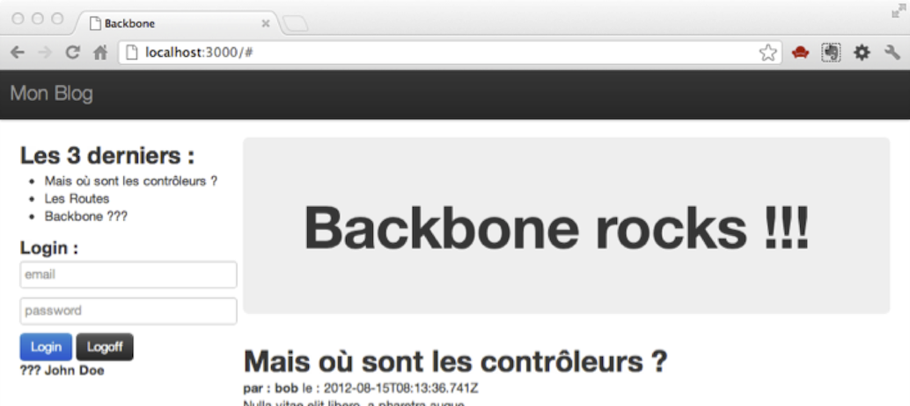


Authentifiez-vous en tapant n’importe quoi :

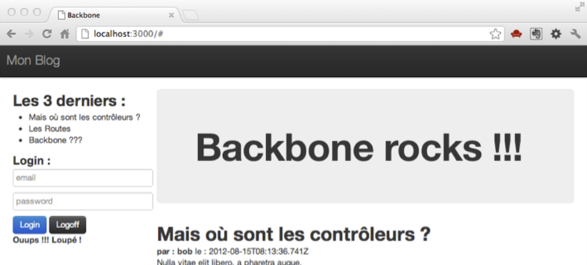


Vous obtenez le message **"Ouups loupé !!!"**

Authentifiez-vous en utilisant un des utilisateurs existant :


Vous obtenez un message de bienvenue.

Vous pouvez essayer de rafraîchir la page, vous restez connecté.

Si vous ouvrez un autre navigateur (une autre marque de navigateur pour être sûr de ne pas partager la session), vous vous apercevez qu’il ne considère pas que vous êtes authentifié :

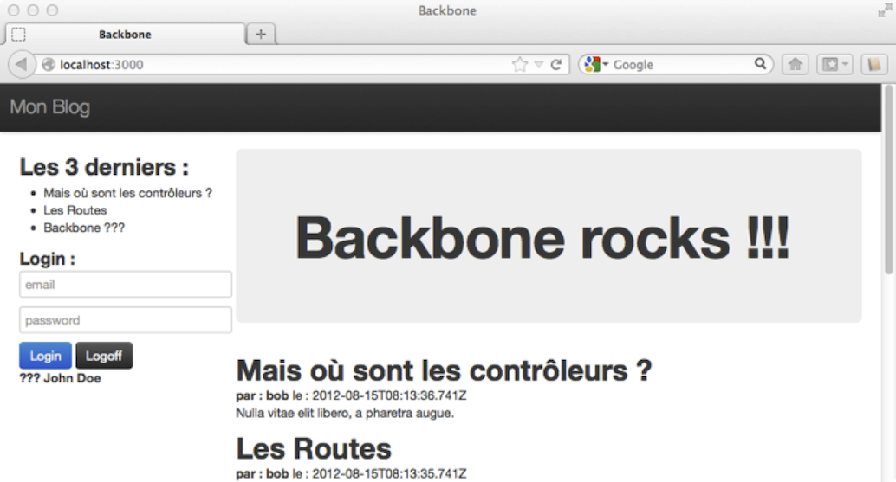


Essayez de vous connecter avec un utilisateur déjà loggé sur une autre session :

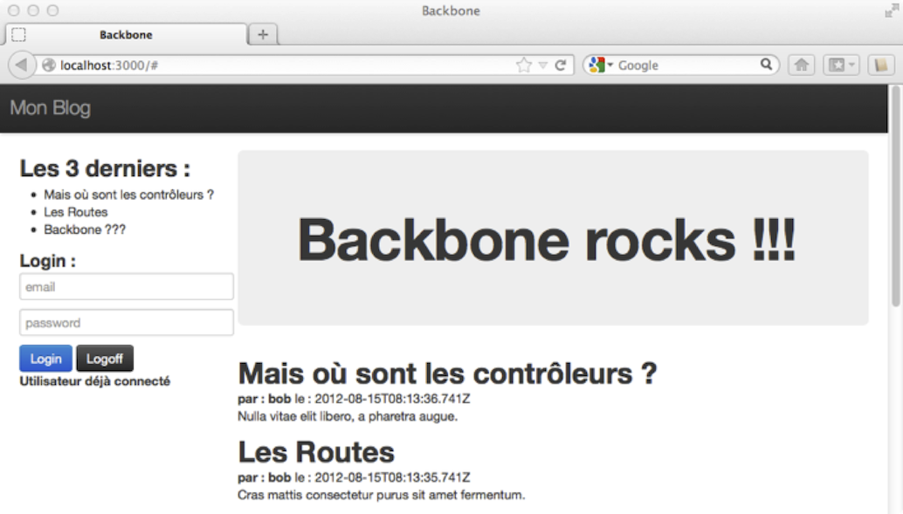


Vous obtenez le message **"Utilisateur déjà connecté"**

Vous disposez maintenant de suffisament d'éléments pour jouer avec les vues. Nous allons pouvoir passer au composant `Backbone.Router`. Nous reviendrons ensuite sur la sécurisation de notre application dans le chapitre sur l'organisation du code.


