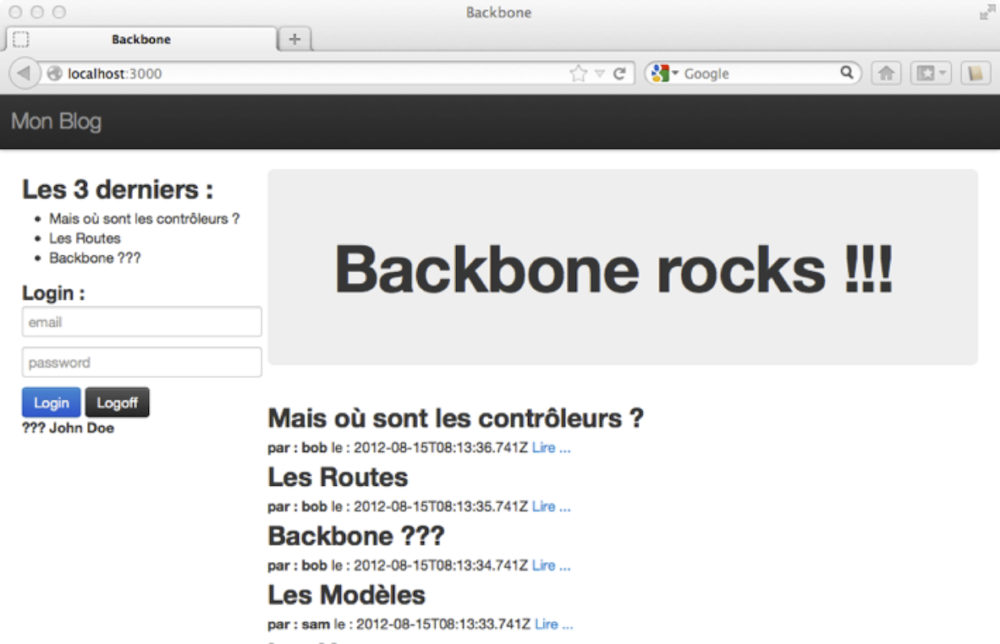
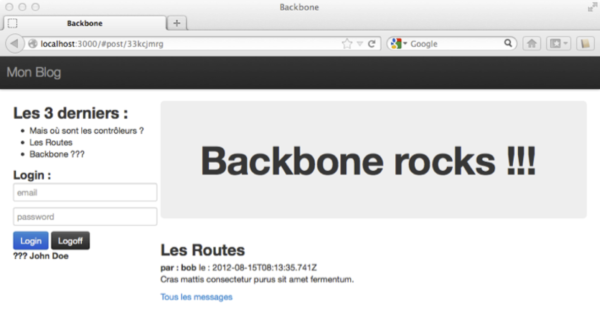
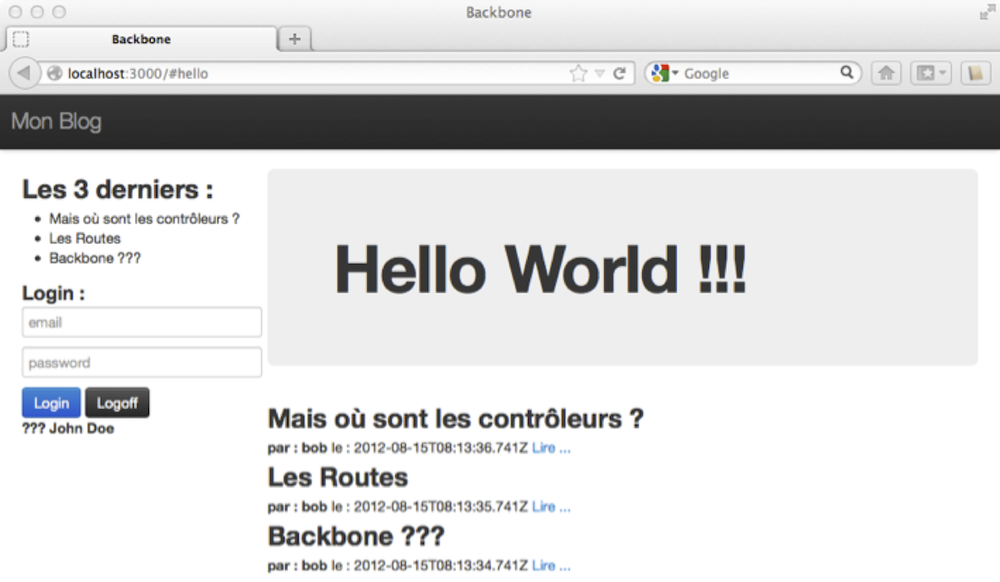

#Le Routeur

>*Sommaire*

>>- *Modifier (un peu) la vue principale*
>>- *Ajouter un template*
>>- *"Maîtriser" les urls*


>*Parmi les composants principaux de Backbone, il y a le Routeur (`Backbone.Router`), qui n’est pas obligatoire pour construire une application Backbone, mais qui néanmoins est très pratique. Son rôle principal est de déclencher des actions en fonction de l’url saisie dans votre navigateur, ou des liens cliqués.*

Dans une SPA (Single Page Application), la barre d’url est un composant à part entière de votre application. C’est une partie à laquelle l’utilisateur accède facilement, vous ne pouvez donc pas l’ignorer, et votre application devra pouvoir réagir en fonction des actions de l’utilisateur. Nous allons donc mettre en œuvre `Backbone.Router` pour pouvoir « réagir » aux changements d’url.
Nous allons transformer notre vue d’affichages de posts, pour qu’elle n’affiche plus le détail des messages, mais à la place un lien qui lorsqu’il sera cliqué affichera le détail du message. Nous verrons qu’ensuite cette méthode nous permettra d’accéder directement à partir de la barre de l’url à des fonctionnalités de notre application.

##Modifions notre vue

Dans la page index.html, modifions le template « posts_list_template » afin qu’il n’affiche plus le contenu du post (`{{message}}`). A la place nous ajoutons un lien dont l’url sera post-fixée de l’id du post (`#post/{{id}}`) :

```html
<script type="text/template" id="posts_list_template">

  {{#posts}}
    <h2>{{title}}</h2>
    <b>par : {{author}}</b> le : {{date}}
    <a href="#post/{{id}}">Lire ...</a>

  {{/posts}}

</script>
```

Ensuite nous ajoutons un nouveau template (pour voir le détail du post) qui sera utilisé lorsque nous cliquerons sur le lien « Lire … », avec un lien (`#/`) qui déclenchera l’affichage de l’ensemble de la liste des posts :

```html
<script type="text/template" id="post_details_template">
  <h2>{{post.title}}</h2>
  <b>par : {{post.author}}</b> le : {{post.date}}
  <p>{{post.message}}</p>

  <a href="#/">Tous les messages</a>
</script>
```

Nous créons ensuite un nouvel objet de type `Backbone.View` qui sera « chargé » d’afficher le détail du message du post, à partir du nouveau template (`#post_details_template`), en lieu et place de la liste des posts (`#posts_list`) :

```javascript
window.PostView = Backbone.View.extend({
  el: $("#posts_list"),
  initialize: function() {
    this.template = $("#post_details_template").html();
  },
  render: function(post) {
    var renderedContent = Mustache.to_html(this.template, {
      post: post.toJSON()
    });
    this.$el.html(renderedContent);
  }

});

window.postView = new PostView();
```

##Création du routeur

Nous pouvons maintenant créer notre routeur. La propriété importante du routeur est `routes`. Dans notre exemple (juste en dessous), je lui ai affecté trois routes :

- `post/:id_post ` : lorsque le clic sur un lien de type `<a href="#post/{{id}}">Lire ...</a>` la méthode `displayPost` du routeur sera appelée avec l’id du post en paramètre
- `hello`, qui appellera la méthode `hello` si par exemple on saisit `http://localhost:3000/#hello` dans la barre d’url du navigateur (notez le “#”, nous y reviendrons plus tard)
- et enfin `*path` qui appellera la méthode `root` pour toute autre url comme `#/`, `/`, …

Le code qui sert à récupérer la liste des posts en provenance du serveur est déplacé dans la méthode `root` du routeur :

*Le routeur de notre application de blog :*

```javascript
window.RoutesManager = Backbone.Router.extend({
  routes: {
    "post/:id_post": "displayPost",
    "hello": "hello",
    "*path": "root"
  },
  root: function() {
    blogPosts.all().fetch({
      success: function(result) {
        //ça marche !!!
      }
    });
  },

  hello: function() {
    $(".jumbotron > h1").html("Hello World !!!");
  },

  displayPost: function(id_post) {

    var tmp = new Post({
      id: id_post
    });

    tmp.fetch({
      success: function(result) {
        postView.render(result);
      }
    });
  }
});

window.router = new RoutesManager();

Backbone.history.start();
```

  //TODO: faire un § sur Backbone.history.start({pushState: true});

Sauvegardez le tout, rafraichissez la page, et testez :

\


Si vous cliquez sur un des liens « Lire … », la liste des posts disparaît au profit du message relatif au post sélectionné :

\


>>**Remarque IMPORTANTE** : Il est maintenant possible d'utiliser des bookmarks pour pointer directement sur les urls des posts du blog.

Maintenant, essayez aussi de taper directement l'url suivante dans la barre d’url : `http://localhost:3000/#hello`. Et là, le titre de notre blog change. Donc l’url peut bien déclencher directement des actions javascript. Vous pouvez donc réagir, prévenir, … toute modification de l’url (comme le retour à la page précédente) pour déclencher l’action nécessaire (par exemple la sauvegarde des données en cours).

\


Voilà. C'est un peu court pour le Routeur, mais cela devrait suffire pour le moment. Maintenant il est temps d'organiser notre code "comme les vrais" avant que notre projet devienne un sac de nouille.

